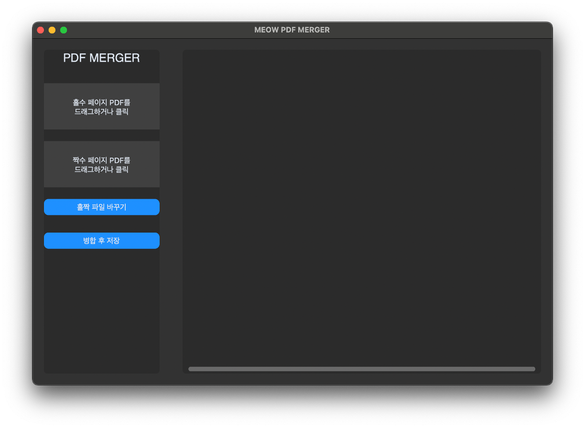

# MEOW PDF MERGER 🐱

**MEOW PDF MERGER**는 단면 스캔만 지원하는 스캐너(ADF) 사용자를 위한 편리한 PDF 병합 도구입니다.  
**MEOW PDF MERGER** is a convenient PDF merge tool for users of scanners that only support single-sided scanning (ADF).

<div align="center">

</div>

---

## 🇰🇷 한국어 (Korean)

### 📖 소개
보통 단면 스캐너로 양면 문서를 스캔할 때, 먼저 앞면(홀수 쪽)을 모두 스캔하고, 종이를 뒤집어 뒷면(짝수 쪽)을 스캔하게 됩니다. 이때 뒷면은 **역순**으로 스캔되는 경우가 많습니다.  
본 프로그램은 **'홀수 정방향 PDF'**와 **'짝수 역순 PDF'**를 입력받아, 페이지 순서를 자동으로 맞춰 하나의 완벽한 PDF로 병합해줍니다.

### ✨ 주요 기능
- **Drag & Drop 지원**: 파일을 UI 위로 드래그하여 간편하게 등록할 수 있습니다.
- **실시간 미리보기**: 병합된 결과물의 페이지 순서를 썸네일로 미리 확인할 수 있어 실수를 방지합니다.
- **홀수/짝수 파일 교체**: 파일을 잘못 넣었을 경우 '홀짝 파일 바꾸기' 버튼으로 즉시 수정 가능합니다.
- **페이지 수 검증**: 두 파일의 페이지 수가 일치하지 않으면 경고를 표시합니다.

### 🛠 설치 및 실행 방법

#### 1. 소스 코드 다운로드
```bash
git clone https://github.com/Ansangho1005/MEOW-PDF-MERGER.git
cd meow-pdf-merger
```

#### 2. 필수 라이브러리 설치 (가상환경 권장)
```bash
# 가상환경 생성 (선택)
python -m venv venv
source venv/bin/activate  # macOS/Linux
# venv\Scripts\activate   # Windows

# 의존성 설치
pip install -r requirements.txt
```

#### 3. 프로그램 실행
```bash
python ui_improved.py
```
> **참고**: `main.py`는 CLI(명령줄) 버전의 간단한 예시 코드이며, 실제 GUI 프로그램은 `ui_improved.py`입니다.

### 📦 실행 파일 빌드 (선택 사항)
PyInstaller를 이용해 단독 실행 파일(.app / .exe)을 만들 수 있습니다.
```bash
# 단순 빌드
pyinstaller "MEOW PDF MERGER.spec"

# 또는 커스텀 빌드 커맨드
pyinstaller --noconsole --onefile --windowed --name="MEOW PDF MERGER" --icon="MEOW-PDF-MERGER_logo.icns" --collect-all customtkinter --collect-all tkinterdnd2 ui_improved.py
```

### ⚠️ 사용 시 주의 사항
- **짝수 페이지 역순 가정**: 짝수 페이지 파일은 **역순**으로 스캔된 상태라고 가정합나다.
- **암호화된 PDF**: 암호가 걸린 PDF는 병합이 실패할 수 있습니다.

---

## 🇺🇸 English

### 📖 Introduction
When scanning double-sided documents with a standard single-sided scanner (ADF), you typically scan all front pages (odd) first, then flip the stack to scan the back pages (even). This often results in the back pages being scanned in **reverse order**.  
**MEOW PDF MERGER** takes these two files (Odd Forward PDF + Even Reverse PDF) and automatically interleaves them to create a single, perfectly ordered PDF.

### ✨ Key Features
- **Drag & Drop Support**: Easily load files by dragging them onto the interface.
- **Real-time Preview**: Verify the merged page order via thumbnails before saving to prevent errors.
- **Swap Files**: Instantly swap Odd and Even files with a button if loaded incorrectly.
- **Page Count Verification**: Alerts you if the page counts of the two files do not match.

### � Installation and Usage

#### 1. Download Source Code
```bash
git clone https://github.com/Ansangho1005/MEOW-PDF-MERGER.git
cd meow-pdf-merger
```

#### 2. Install Dependencies
```bash
# Create Virtual Environment (Optional but recommended)
python -m venv venv
source venv/bin/activate  # macOS/Linux
# venv\Scripts\activate   # Windows

# Install packages
pip install -r requirements.txt
```

#### 3. Run the Application
```bash
python ui_improved.py
```
> **Note**: `main.py` is a simple CLI example. The main GUI application is `ui_improved.py`.

### 📦 Build Standalone App (Optional)
You can create a standalone executable using PyInstaller.
```bash
# Build using spec file
pyinstaller "MEOW PDF MERGER.spec"

# Or using custom command
pyinstaller --noconsole --onefile --windowed --name="MEOW PDF MERGER" --icon="MEOW-PDF-MERGER_logo.icns" --collect-all customtkinter --collect-all tkinterdnd2 ui_improved.py
```

### ⚠️ Precautions
- **Reverse Even Pages**: The tool assumes the even pages file is in **reverse order**.
- **Encrypted PDFs**: PDFs with passwords may fail to merge.

---

## 📄 License
MIT License
